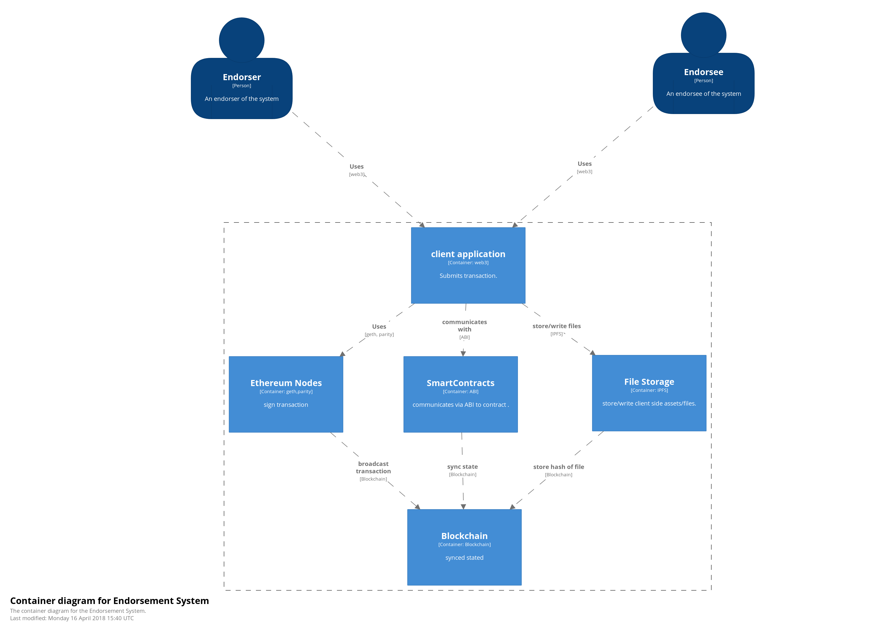
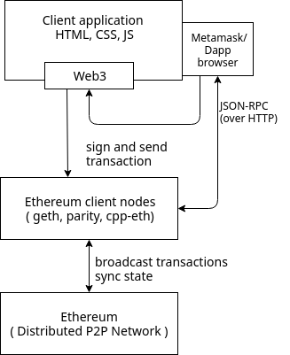
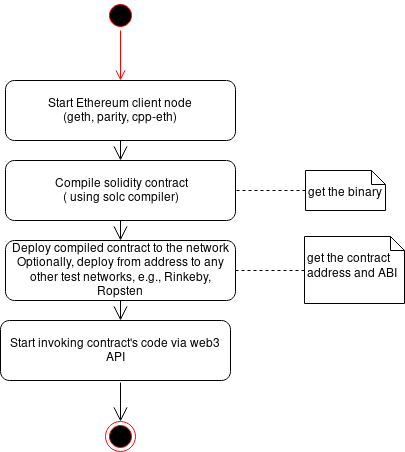
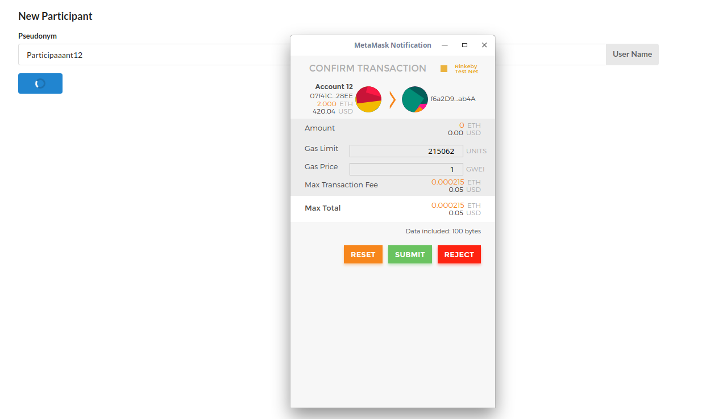
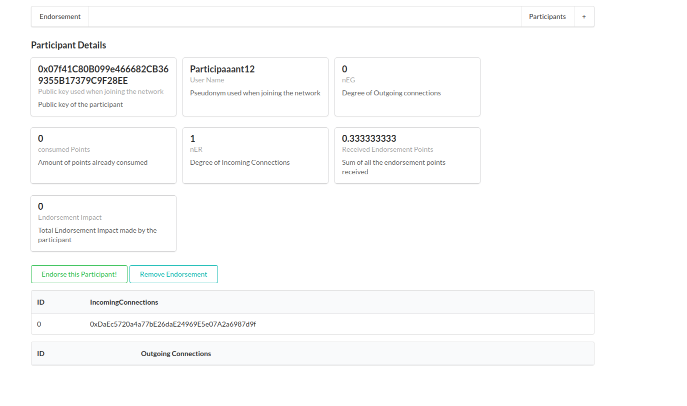
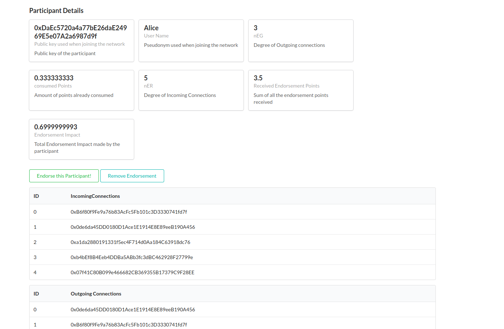

# Decentralized reputation system based on blockchain and smart contracts.

### Tools and technologies:

* Blockchain Network: Ethereum, Implementation tested on Rinkeby Test Network and Local ganache node
    Smart contract written using Solidity 
* Web application: React.js for frontend and node.js as a backend server 
* External libraries and APIs used: Metamask wallet, neo4j and its cypher query for graph simulation, Python for simple scripts, mocha for unit testing.

### System Architecture:

#### Container diagram

#### Client application and solidity contract deployment

                  

 
 ### Single Page React application (screenshots)
 
 #### New User Registration

 #### Record incoming endorsement connection
 
 
  #### Incoming and outgoing endorsements recorded

